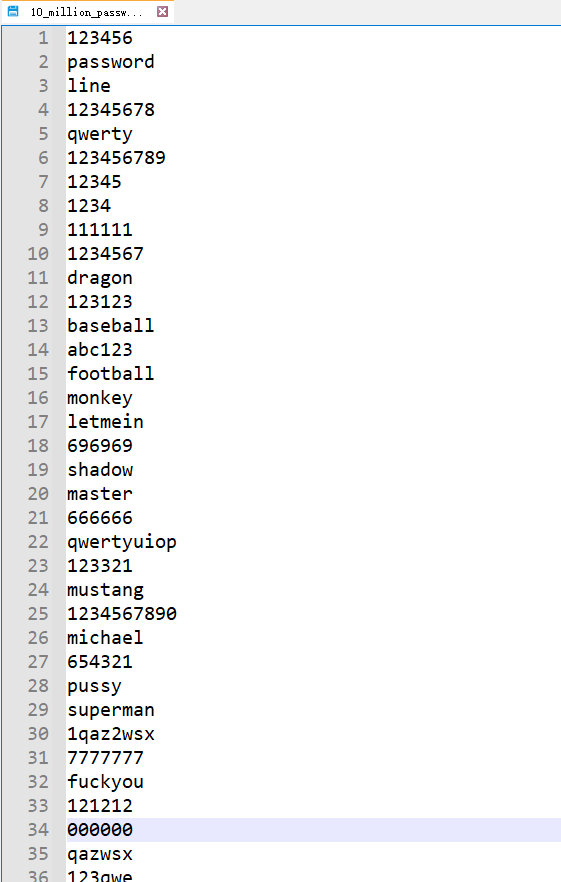
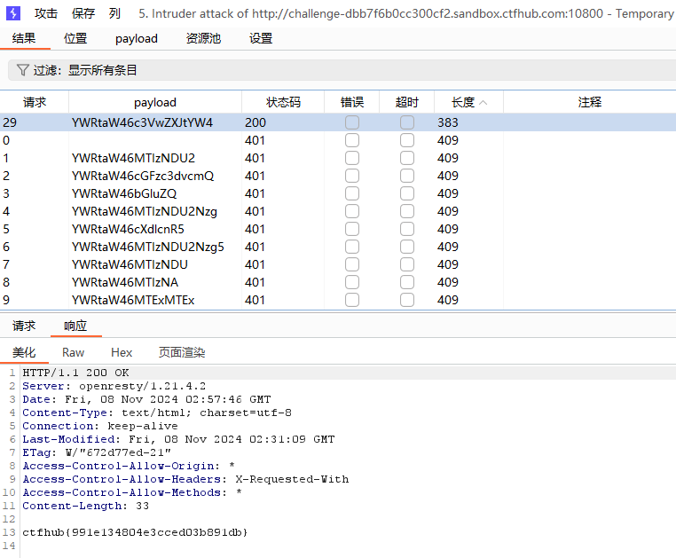

# 基础认证

进入网页，发现超链接，点击提示登录，输入`admin\admin`提交，未果，抓包分析

> 

注意到`Authorization`头，对值进行base64解码，得到`admin:admin`，确定是刚才输入的值

> 

在响应头中可以看到提示`WWW-Authenticate: Basic realm="Do u know admin ?"`，也就是说用户名肯定是`admin`，需要寻找密码

> 

返回题目，题目本身包含了一个文件，打开后是很多常用密码，可能是需要用这个文件中的密码来爆破

> 

将所有的密码前面加上`admin:`，然后进行`base64`编码

*tip:在文本文档中，按`ctrl`+`H`键进入替换窗口，然后勾选`正则表达式`，查找目标设置为`^`，代表行头，就可以快捷替换*

> 

将所有的`base64`编码导入`Burpsuite`进行爆破，注意这里的所有等号需要删除，因为会自动转换为`url`编码

> 

```flag
ctfhub{991e134804e3cced03b891db}
```

