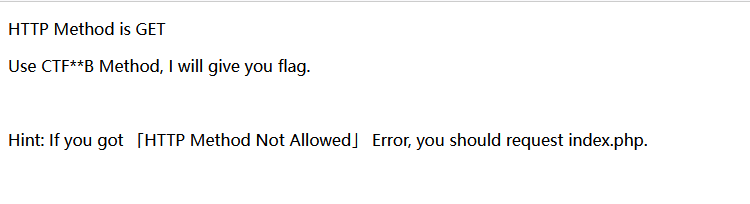
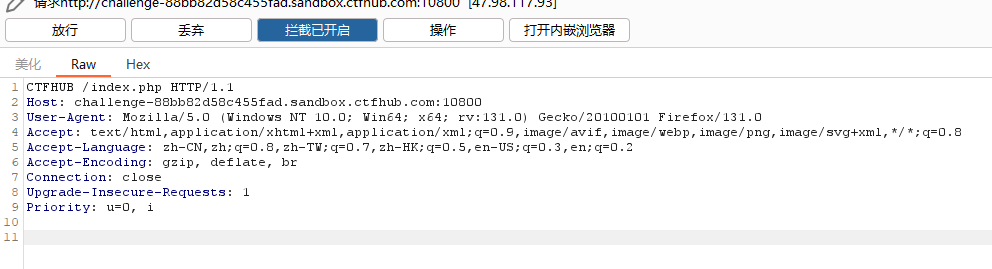
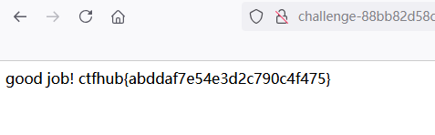

# 请求方式

页面中出现提示

> 

**英文翻译**

> HTTP请求为`GET`方式
>
> 使用`CTF**B`方式，我将会给你flag
>
> 提示：如果你得到了`不被允许的HTTP请求方式`错误，你应该向`index.php`发送请求

*怎么还考英文啊？*

因此，只要将请求改为`CTFHUB`发送就可以了

> 

发送请求，得到flag

> 

```flag
ctfhub{abddaf7e54e3d2c790c4f475}
```

