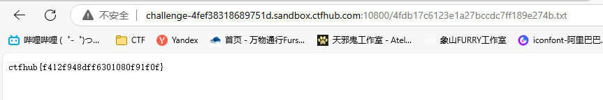

# .DS_Store

`.DS_Store`是 Mac OS 保存文件夹的自定义属性的隐藏文件。通过`.DS_Store`可以知道这个目录里面所有文件的清单。

直接访问`.DS_Store`下载文件，然后放进kali里，cat找到一个文本文档`4fdb17c6123e1a27bccdc7ff189e274b.txt`

> 

在网页中访问`4fdb17c6123e1a27bccdc7ff189e274b.txt`，得到flag

> 

```flag
ctfhub{f412f948dff6301080f91f0f}
```

