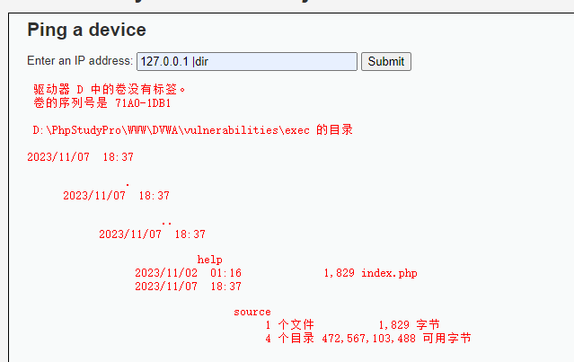
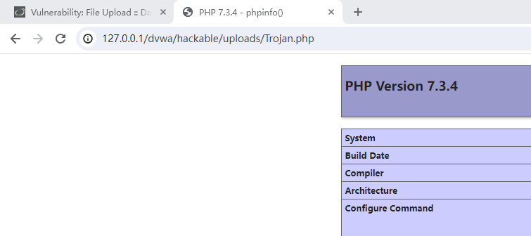
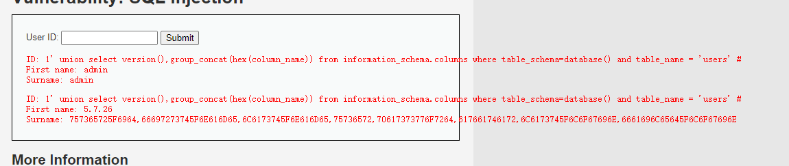
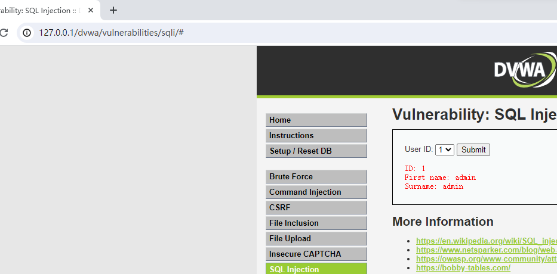

# DVWA 学习笔记

`更新时间：2023-11-15`

注释解释：

- `<>`必填项，必须在当前位置填写相应数据

- `{}`必选项，必须在当前位置选择一个给出的选项

- `[]`可选项，可以选择填写或忽略

# 暴力破解 Brute Force

## Low

先输入任意用户名与密码尝试登录

> 

打开BurpSuite进行抓包

> 

可以直接获取用户名及密码，右键发送到Intruder

> 

点击右边的 `清除Payload位置` ，然后再双击用户名，点击 `添加Payload位置` ，密码相同操作，再把攻击类型设置为 `集束炸弹`

> 

切换到 `Payload` 分页，设置 `Payload集` 为1（即用户名），在 `Payload settings` 栏下导入字典或手动添加可能出现的用户名，然后设置 `Payload集` 为2（即密码），进行相同操作

> 

> 

点击 `开始攻击` ，攻击完成后，找到长度与其他不同的一项并点击，选择下方 `响应 > 页面渲染` ，发现破解成功，用户名为admin，密码为password

> 

## Medium

Medium操作和Low一致，从源码得知仅仅是在登录失败后添加了2秒的系统休眠，延长了攻击时间

> 

破解成功

> 

## High

通过代码分析，High难度将休眠时间设置为了0到3秒随机数，并增加了token验证。token的作用是为每个登录成功的IP增加一个密匙，每次该IP登录服务器时不需要通过验证就能直接登入，减小服务器负担

> 

如果登陆失败token会刷新，所以我们使用 `Pitchfork` 攻击。在使用 `Pitchfork` 攻击时，只能设置两个 `Payload` ，所以我们设定已知用户名admin，爆破密码和token

> 

与密码不同，token需要每次爆破时重新获取，先设置获取token。选择设置分页，下滑找到 `检索-提取` ，勾上 `从响应包中提取以下项目` ，点击 `添加`

> 

点击 `重新获取响应` ，下滑找到token，双击，并按复制下来，后面会使用，然后点击 `确定` 返回

> 

回到 `Payload` 分页，先同上文一样填入密码，然后选择 `Payload集` 为2，设置 `Payload类型` 为递归提取，并在下方 `Payload Setting` 下的 `首次请求初始payload` 栏里填入刚才复制的token

> 

然后转到 `资源池` 分页，下滑选择 `新建资源池` ， `最大并发请求数` 设置为2， `请求间隔` 设置为300，然后点击 `开始攻击`

> 

等待攻击完成，会有两个长度不同的项，点击下方的 `响应 > 页面渲染` 找到正确项即可

> 

# 命令注入 Command Injection

## Low

提示输入一个IP地址，输入127.0.0.1进行尝试，发现返回格式与cmd中ping一致

> 

> 

查看源码，发现是对输入的ip执行ping命令

> 

使用命令连接符进行尝试，注入成功

> 

命令连接符：

- `a & b` ：a与b都会执行，无制约关系

- `a && b` ：a为真，才会执行b

- `a | b` ：无论a是否为真，都会执行b

- `a || b` ：若a为真不执行b，若a为假才执行b

- `a ; b ; c` ：执行多个命令，命令之间无制约

## Medium

查看源码，发现将 `&&` 和 `;` 加入了黑名单

> 

但是可以使用黑名单之外的连接符

> 

## High

查看源码，发现黑名单中包含了所有可用的命令连接符，但是仔细查看，发现 `'| '`后多了个空格，此时 `|` 后若不带空格直接跟命令不受影响

> 

填入 `127.0.0.1 |dir` 注入成功

> 

# 跨站请求伪造 CSRF

## Low

查看网页，提示更改密码，输入pass进行尝试，密码更改成功

> 

进行登录验证，密码已经被更改为pass

> 

回到刚才的页面，仔细观察，发现url栏中显示了更改的密码

> 

观察url栏：
http://127.0.0.1/dvwa/vulnerabilities/csrf/?password_new=pass&password_conf=pass&Change=Change#
password_new是新密码，password_conf是确认密码，说明输入的信息可能会在url栏进行传输执行。进行抓包，发现请求信息与url栏信息一致

> 

尝试对url栏内容进行修改，新建标签页进行提交，这里我将密码改为root

> 

进行登录验证，密码更改成功

> 

分析源码，只对传入的两个密码进行比较，没有任何过滤，可以轻易执行CSRF攻击

> 

## Medium

分析源码，Medium难度在接收输入之前验证了请求的来源，必须要referer中包含server_name的请求才会被通过

> 

因此我们需要想办法在referer中添加相应的server_name，referer中记录的是网站的请求来源，进行抓包查看当前的referer

> 

从上图中可以看出，referer内容为 `http://127.0.0.1/dvwa/vulnerabilities/csrf/` ，并不包含我们需要的server_name。如果我们通过a网站的超链接访问b网站时，referer中记录的将会是a网站的url，下面进行一个验证，我们在本地创建一个html，内包含一个a标签，指向我的b站个人主页，另外比较通过直接访问b站个人主页时的referer

- 直接访问

> 

- 构建超链接

> 

通过这个原理，我们可以尝试在本地创建一个html文件，在这个文件中插入一个a标签，指向我们想要更改密码的url，再把文件名改为相应的server_name。我的server_name为localhost，所以我将文件名改为localhost.html

> 

打开html文件，点击超链接，进行抓包查看referer

> 

可以看到，referer中已经被添加了server_name，对抓包放行也发现密码更改成功，进行登陆验证，CSRF攻击成功

> 

# 文件包含漏洞 File Inclusion

## Low

有三个文件可以选择，依次点击，发现url栏中文件名会传参给page

> 

在page后输入file4.php，成功

> 

再输入<span>http://</span>localhost/test.php，同样成功

> 

## Medium

先看源码，对http、https、../、..//设置了过滤，将其设置为空。

> 

但是仅过滤全等字符，可以用h<b>http://</b>ttp:// 来代替。其中的<b>http://</b>被设置为空后，依然存在一个http://

> 

## High

同样先看源码，High强制文件开头为file

> 

但是同样可以使用file协议读取文件

> 

*注：file协议，即本地文件传输协议，语法是file://文件位置*

# 文件上传漏洞 File Upload

## Low

先创建一个php木马文件，内含一条phpinfo指令

> 

上传文件，提示上传成功

> 

尝试打开文件，攻击成功

> 

## Medium

上传文件，提示只能上传后缀为JPGE和PNG的文件

> 

将Trojan.php后缀名改为png，上传并抓包，将filename改为medium.php并放行，提示上传成功

> 

# SQL注入 SQL Injection

## Low 

输入ID查询相关信息，，并且ID显示在url栏中

> 

怀疑可能是将ID带入数据库中进行查询，判断是否存在注入点

- 使用逻辑运算符，结果不为空，可能存在注入点

> 

- 使用单引号报错（单引号闭合），未过滤异常字符

> 

- 在引号后添加注释，正常返回结果，最终确定存在注入点

> 

使用order by判断字段数，避免后面使用联合查询时报错。先设定一个比较大的数目，这里选择5

> 

报错，则使用二分法，这次选择3

> 

依然报错，数字减一，查询成功，可以确定结果返回两个字段

> 

使用union联合查询观测回显点，本题只有两个字段，就在union后的查询语句内设定两个数字，查看显示位置

> 

通过上图确认回显点为1，2，开始注入，查询当前数据库

> 

查询所有表名

**基本语法**

```sql
1' union select version(),group_concat(table_name) from information_schema.tables where table_schema=database() #
```

> 

*注：默认情况下直接使用group_concat(fieldname)，如果报错Illegal mix of collations for operation 'UNION'，请使用group_concat(hex(fieldname))将结果转换为16进制字符，然后使用转换器获取结果*

转换后的结果：guestbook , users

查询users下所有字段名

**基本语法**

```sql
1' union select version(),group_concat(column_name) from information_schema.columns where table_schema=database() and table_name = 'users' #
```

> 

转换后的结果：user_id , first_name , last_name , user , password , avatar , last_login , failed_login

从中可以看出users表内记录了user和password，获取管理员账号及密码

**基本语法**

```sql
1' union select user,password from users where user_id = 1 #
```

> 

对结果进行md5解密，密码为admin，注入成功

> 

## Medium

打开页面，发现是通过选项查询结果

> 

推测可能是通过POST传参，进行抓包，推测正确

> 

右键，点击 `发送到Repeater` 进行重复发包

> 

先判断是否存在注入点

> 

> 

确认为数据型查询，不存在单引号闭合，直接判断字段数量

> 

> 

确认字段数为2，使用联合查询判断回显点

> 

查询数据库名

> 

查询表名

> 

查询users下所有字段名

> 

报错，怀疑是引号出现的问题，MySQL默认支持HEX编解码，使用HEX编码尝试

> 

*注：使用HEX字符编码时，应在编码前添加 `0x` 标识符*

查询管理员账号密码，注入成功

> 

# High

出现一个链接，打开时查询页面，考虑是传参

> 

输入1并提交，确认进行传参

> 

判断是否存在注入点，重复Low操作

> 

> 

> 

...

*注：其他步骤省略*